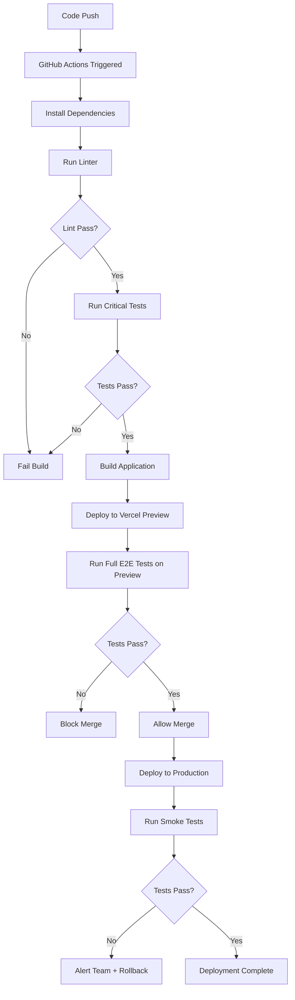

# CI/CD Integration Guide for Playwright Tests

Complete guide for integrating Playwright E2E tests into your deployment pipeline.

## Table of Contents

- [Overview](#overview)
- [GitHub Actions Setup](#github-actions-setup)
- [Vercel Integration](#vercel-integration)
- [Environment Variables](#environment-variables)
- [Deployment Gating](#deployment-gating)
- [Monitoring and Alerts](#monitoring-and-alerts)
- [Best Practices](#best-practices)

## Overview

This guide covers integrating Playwright tests into your CI/CD pipeline to:

- Run tests automatically on every commit
- Test Vercel preview deployments before merging
- Verify production deployments
- Gate deployments based on test results
- Monitor test health over time

## GitHub Actions Setup

### Basic Workflow

The provided `.github/workflows/playwright.yml` includes:

1. **Main Test Job**: Runs full test suite in parallel (sharded)
2. **Critical Path Job**: Fast critical tests that must pass
3. **Mobile Verification**: Mobile-specific testing
4. **Security Tests**: Security-focused test suite
5. **Report Merging**: Combines sharded test results

### Required GitHub Secrets

Add these secrets in **Settings → Secrets and variables → Actions**:

```bash
# Application
NEXT_PUBLIC_APP_URL                 # Your app URL
NEXT_PUBLIC_SUPABASE_URL           # Supabase project URL
NEXT_PUBLIC_SUPABASE_ANON_KEY      # Supabase anon key
SUPABASE_SERVICE_ROLE_KEY          # Supabase service role key

# API Keys
ANTHROPIC_API_KEY                   # Anthropic AI API key

# Auth0
AUTH0_SECRET                        # Auth0 secret
AUTH0_BASE_URL                      # Auth0 base URL
AUTH0_ISSUER_BASE_URL              # Auth0 issuer URL
AUTH0_CLIENT_ID                     # Auth0 client ID
AUTH0_CLIENT_SECRET                 # Auth0 client secret
```

### Workflow Triggers

The workflow runs on:

```yaml
on:
  push:
    branches: [main, develop]      # Every push to main/develop
  pull_request:
    branches: [main, develop]      # Every PR to main/develop
  workflow_dispatch:                # Manual trigger
```

### Parallel Execution

Tests run in parallel across 4 shards for faster execution:

```yaml
strategy:
  matrix:
    shard: [1, 2, 3, 4]
```

Adjust the number based on your test suite size and available runners.

## Vercel Integration

### Testing Preview Deployments

Create `.github/workflows/vercel-preview.yml`:

```yaml
name: Test Vercel Preview

on:
  pull_request:
    types: [opened, synchronize, reopened]

jobs:
  test-preview:
    runs-on: ubuntu-latest
    timeout-minutes: 30

    steps:
      - uses: actions/checkout@v4

      - uses: actions/setup-node@v4
        with:
          node-version: 18
          cache: 'npm'

      - name: Install dependencies
        run: npm ci

      - name: Install Playwright
        run: npx playwright install --with-deps chromium

      - name: Wait for Vercel Preview
        uses: patrickedqvist/wait-for-vercel-preview@v1.3.1
        id: wait-for-vercel
        with:
          token: ${{ secrets.GITHUB_TOKEN }}
          max_timeout: 300

      - name: Run production verification tests
        run: npm run test:production
        env:
          VERCEL_PREVIEW_URL: ${{ steps.wait-for-vercel.outputs.url }}
          NEXT_PUBLIC_SUPABASE_URL: ${{ secrets.NEXT_PUBLIC_SUPABASE_URL }}
          NEXT_PUBLIC_SUPABASE_ANON_KEY: ${{ secrets.NEXT_PUBLIC_SUPABASE_ANON_KEY }}
          SUPABASE_SERVICE_ROLE_KEY: ${{ secrets.SUPABASE_SERVICE_ROLE_KEY }}
          ANTHROPIC_API_KEY: ${{ secrets.ANTHROPIC_API_KEY }}

      - name: Comment PR with preview test results
        uses: actions/github-script@v7
        if: always()
        with:
          script: |
            const status = '${{ job.status }}' === 'success' ? '✅' : '❌';
            const message = `${status} Preview deployment tests ${job.status}!\n\n`;
            const url = '${{ steps.wait-for-vercel.outputs.url }}';

            github.rest.issues.createComment({
              issue_number: context.issue.number,
              owner: context.repo.owner,
              repo: context.repo.repo,
              body: message + `Preview URL: ${url}`
            });
```

### Testing Production Deployments

Create `.github/workflows/production-smoke-test.yml`:

```yaml
name: Production Smoke Tests

on:
  deployment_status:

jobs:
  smoke-test:
    if: github.event.deployment_status.state == 'success'
    runs-on: ubuntu-latest
    timeout-minutes: 15

    steps:
      - uses: actions/checkout@v4

      - uses: actions/setup-node@v4
        with:
          node-version: 18

      - name: Install dependencies
        run: npm ci

      - name: Install Playwright
        run: npx playwright install --with-deps chromium

      - name: Run critical path tests against production
        run: npm run test:critical -- --project=chromium
        env:
          TEST_ENV: production
          PRODUCTION_URL: ${{ github.event.deployment_status.target_url }}
          NEXT_PUBLIC_SUPABASE_URL: ${{ secrets.NEXT_PUBLIC_SUPABASE_URL }}
          NEXT_PUBLIC_SUPABASE_ANON_KEY: ${{ secrets.NEXT_PUBLIC_SUPABASE_ANON_KEY }}
          SUPABASE_SERVICE_ROLE_KEY: ${{ secrets.SUPABASE_SERVICE_ROLE_KEY }}

      - name: Notify on failure
        if: failure()
        uses: actions/github-script@v7
        with:
          script: |
            github.rest.repos.createCommitStatus({
              owner: context.repo.owner,
              repo: context.repo.repo,
              sha: context.sha,
              state: 'failure',
              context: 'Production Smoke Tests',
              description: 'Critical tests failed in production'
            });
```

## Environment Variables

### Required for All Environments

```bash
# Database
NEXT_PUBLIC_SUPABASE_URL
NEXT_PUBLIC_SUPABASE_ANON_KEY
SUPABASE_SERVICE_ROLE_KEY

# AI API
ANTHROPIC_API_KEY

# Auth (if testing auth features)
AUTH0_SECRET
AUTH0_BASE_URL
AUTH0_ISSUER_BASE_URL
AUTH0_CLIENT_ID
AUTH0_CLIENT_SECRET
```

### Environment-Specific

```bash
# Local testing
NEXT_PUBLIC_APP_URL=http://localhost:3000

# Staging
NEXT_PUBLIC_APP_URL=https://staging.example.com

# Production
TEST_ENV=production
PRODUCTION_URL=https://yourdomain.com

# Vercel Preview
VERCEL_PREVIEW_URL=preview-abc123.vercel.app
```

## Deployment Gating

### Require Tests to Pass Before Merge

In **Settings → Branches → Branch protection rules** for `main`:

- ✅ Require status checks to pass before merging
- ✅ Select checks:
  - `Run Playwright Tests`
  - `Critical Path Verification`
  - `Test Vercel Preview`

### Auto-Rollback on Test Failure

Add to your Vercel deployment or GitHub Actions:

```yaml
- name: Rollback on test failure
  if: failure()
  run: |
    # Trigger rollback to previous deployment
    vercel rollback --token ${{ secrets.VERCEL_TOKEN }}
```

### Manual Approval Gate

For production deployments:

```yaml
jobs:
  deploy:
    needs: [test, security-tests]
    environment:
      name: production
      url: https://yourdomain.com
    runs-on: ubuntu-latest

    steps:
      # Deploy steps...
```

This requires manual approval in GitHub Environments.

## Monitoring and Alerts

### Test Result Tracking

#### Store Test Metrics

```yaml
- name: Store test metrics
  if: always()
  run: |
    # Parse test results
    cat test-results/results.json | \
    jq '{date: now | todateiso8601, passed: .suites[].specs[].tests[].results[] | select(.status=="passed") | length}' \
    >> metrics/test-metrics.jsonl
```

#### Track Flaky Tests

```yaml
- name: Detect flaky tests
  run: npx playwright test --reporter=json > results.json
  continue-on-error: true

- name: Analyze flaky tests
  run: |
    node scripts/analyze-flaky-tests.js results.json
```

### Slack Notifications

Add Slack integration:

```yaml
- name: Notify Slack on failure
  if: failure()
  uses: slackapi/slack-github-action@v1.24.0
  with:
    payload: |
      {
        "text": "❌ Playwright tests failed",
        "blocks": [
          {
            "type": "section",
            "text": {
              "type": "mrkdwn",
              "text": "❌ *Playwright Tests Failed*\n*Branch:* ${{ github.ref }}\n*Commit:* ${{ github.sha }}\n<${{ github.server_url }}/${{ github.repository }}/actions/runs/${{ github.run_id }}|View Details>"
            }
          }
        ]
      }
  env:
    SLACK_WEBHOOK_URL: ${{ secrets.SLACK_WEBHOOK_URL }}
```

### Email Notifications

```yaml
- name: Send email on critical failure
  if: failure() && github.ref == 'refs/heads/main'
  uses: dawidd6/action-send-mail@v3
  with:
    server_address: smtp.gmail.com
    server_port: 465
    username: ${{ secrets.EMAIL_USERNAME }}
    password: ${{ secrets.EMAIL_PASSWORD }}
    subject: Critical Test Failure in Production
    body: |
      Critical Playwright tests failed in production deployment.

      Branch: ${{ github.ref }}
      Commit: ${{ github.sha }}
      Run: ${{ github.server_url }}/${{ github.repository }}/actions/runs/${{ github.run_id }}

      Please investigate immediately.
    to: team@example.com
```

## Best Practices

### 1. Test Execution Speed

**Optimize for CI/CD:**

```yaml
# Run critical tests first
- name: Quick smoke test
  run: npm run test:critical

# Only run full suite if smoke tests pass
- name: Full test suite
  if: success()
  run: npm test
```

**Parallel Execution:**

```bash
# Split tests across runners
npx playwright test --shard=1/4
npx playwright test --shard=2/4
npx playwright test --shard=3/4
npx playwright test --shard=4/4
```

### 2. Artifact Management

**Keep Only Recent Artifacts:**

```yaml
- uses: actions/upload-artifact@v4
  with:
    name: test-results
    path: test-results/
    retention-days: 7  # Delete after 7 days
```

**Selective Upload:**

```yaml
# Only upload videos on failure
- uses: actions/upload-artifact@v4
  if: failure()
  with:
    name: failure-videos
    path: test-results/videos/
```

### 3. Caching

**Cache Dependencies:**

```yaml
- uses: actions/setup-node@v4
  with:
    node-version: 18
    cache: 'npm'  # Cache npm dependencies
```

**Cache Playwright Browsers:**

```yaml
- name: Cache Playwright browsers
  uses: actions/cache@v3
  with:
    path: ~/.cache/ms-playwright
    key: ${{ runner.os }}-playwright-${{ hashFiles('**/package-lock.json') }}
```

### 4. Conditional Test Execution

**Run Different Tests Based on Changes:**

```yaml
- name: Detect changed files
  id: changes
  uses: dorny/paths-filter@v2
  with:
    filters: |
      blog:
        - 'app/blog/**'
      api:
        - 'app/api/**'

- name: Run blog tests
  if: steps.changes.outputs.blog == 'true'
  run: npm run test:blog

- name: Run API tests
  if: steps.changes.outputs.api == 'true'
  run: npm run test:api
```

### 5. Test Environment Isolation

**Use Separate Test Database:**

```yaml
env:
  # Use test-specific database
  NEXT_PUBLIC_SUPABASE_URL: ${{ secrets.TEST_SUPABASE_URL }}
  SUPABASE_SERVICE_ROLE_KEY: ${{ secrets.TEST_SUPABASE_SERVICE_KEY }}
```

**Reset Database Before Tests:**

```yaml
- name: Reset test database
  run: npm run db:reset:test
```

### 6. Retry Strategy

**Retry Failed Tests:**

```yaml
# In playwright.config.ts
export default defineConfig({
  retries: process.env.CI ? 2 : 0,
});
```

**Retry Entire Workflow:**

```yaml
- name: Run tests with retry
  uses: nick-fields/retry@v2
  with:
    timeout_minutes: 30
    max_attempts: 2
    command: npm test
```

## Troubleshooting

### Common Issues

**1. Timeout in CI:**

```yaml
# Increase timeout
- name: Run tests
  run: npm test
  timeout-minutes: 60
```

**2. Browser Installation Fails:**

```yaml
# Install with dependencies
- run: npx playwright install --with-deps
```

**3. Flaky Tests:**

```yaml
# Run in retries mode
retries: 2

# Or increase timeouts
timeout: 60000
```

**4. Out of Memory:**

```yaml
# Reduce parallel workers
workers: 1

# Or use larger runner
runs-on: ubuntu-latest-4-cores
```

## Example: Complete CI/CD Pipeline



---

**Last Updated**: 2025-11-16
**Maintained By**: Development Team
**Questions**: Create an issue in the repository
